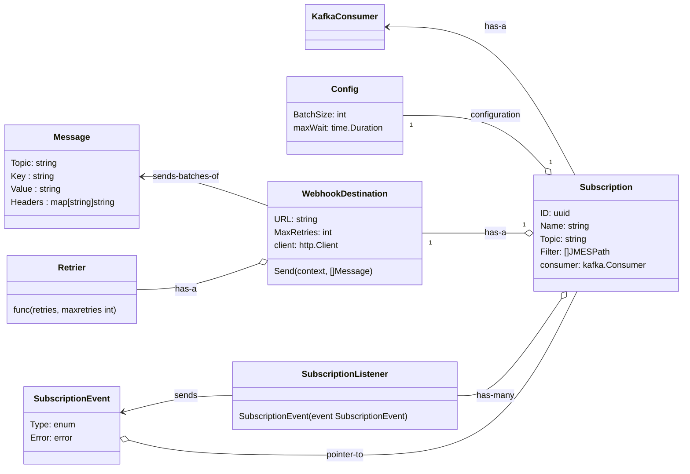

# webhookd

https://github.com/confluentinc/confluent-kafka-go/tree/v1.4.0

Provides the following functions:

- Sources are Kafka topics
- Registration includes 
    - Callback url eg: https://my-website.com/path/to/endpoint
    - Authentication for that endpoint:
        - Token: http_header + token value
    - Topics, list to subscribe to
- Authorization
    - Policy that specifys what payloads can be viewed from the topics subscribed to.
- Retry mechanism
- Rate limiting
- Message batching
- Message serialisation
- Monitoring and logging
- Error handling
    - Deliver errors to clients
    - System errors
- Management API

# API

`POST 1/Subscription`

```json
{
    "name":         "{string}",
    "active":       "{reference:yes|no}",
    
    "destination": {
        "kind": "reference:webhook",
        "webhook": {
            "url":  "{url}", 
            "headers": [ "{string}" ],  // Can include a shared secret
        },
    },
    
    "source": [
        {
            "topic": "string",    // Kafka topic to subscribe to
            "jmes_filters": [ "{JMES expression}" ] // Optional JMES expression applied to filter messages ANDed together
        }
    ],
    
    "configuration": {
        "batching": {
            "max_batch_size": {int},  // 1 >= x <= 1000
            "max_batch_interval_seconds": {int}  // Max amount of time to wait before sending a batch in seconds eg: 60 means 1 minute. 1 <= x <= 300
        },
        "payload_size": {
            "max_payload_size_kb": {int}, // eg: 10 means 10 * 1024 bytes. 1 <= x <= 5000
        },
        "retry": {
            "max_retries": {int},  // >= 0. 0 Means no retries. 0 <= x <= 10
            "retry_algorithm": "reference:exponential_backoff|fixed_time"
        },
        "alerting": {
            "alert_channel": "reference:email",
            "alert_emails": [ "{email}", ...]
        }
    }
}
```

# Registration works as follows:

Client `POST 1/Subscription` with above payload, and are returned similar response but with `"id": {uuid}` and `"kind": "Webhook"`

# Processing

After registration has occurred:
- The system creates a new  Kafka consumer with a group-id `webhooks-{webhook-id}`.
- Add 'active' to recent_activity
- Starts a go-routine that:
    - reads each message
    - filters through the optional JMES filter.
    - batches the messages
    - send a batch through the webhook
    - on success -> commit the offsets
    - on failure -> pause and reset the offsets to last know position for retry
    - Add 'api_call' to recent_activity
    - if failed, invoke the alerting module
        - decide on the new  `status` -> `healthy` | `unhealthy`
        - decide if alerts need to be sent

# Take all webhooks offline

`POST 1/EventNotificationAdmin` to make management changes:

```json
{
    "status":           "{reference:online|offline}",
    "offline_message":  "{string}"
}
```

- if updated `status`
- communicate with all go-routines

`GET 1/EventNotificationAdmin` to view a status of the system:

```json
{
    "id":               "{uuid}",
    "kind":             "WebhookAdmin",
    "status":           "{reference:online|offline}",
    "offline_message":  "{string}",
    "webhooks": {
        {
            "id":           "{uuid}",
            "name":         "string",
            "timestamp":    "{datetime}",
            "status":       "reference:healthy|unhealthy|inactive", 
            "topics": [ "{string}" ]
        }
    }
}
```


# If update to take offline

- Kill go-routine
- Add 'inactive' to recent_activity


# Status check 

Clients can get webhook status as follows:

`GET 1/Subscription/{id}/Status`, which returns the runtime status of the webhook:

```json
{
    "id":           "{uuid}",
    "kind":         "WebhookStatus",
    "name":         "{string}",
    "active":       "{reference:yes|no}",
    "payload_url":  "{url}",  
    "timestamp":   "{datetime}",
    "status":       "reference:healthy|unhealthy|inactive",
    "recent_activity": [
        {
            "timestamp": "{datetime}",
            "event":     "reference:api_call|active|inactive",

            // If event is "api_call" provide these 
            "request":   "POST {url}",
            "request_headers": [ "{string}" ],
            "response_code": {int},
            "response_body": "{string}",
            "response_headers": [ "{string}" ]
        }
        .. 
    ]
}
```


# Data structures




# Tests

## Unit tests

Unit tests run automatically when a Pull Request is updated, or merged.

To run tests locally you can run:

```
docker compose up
make test
```

## Load test

Because load tests take a long time to run, and open source projects have [billing limits](https://docs.github.com/en/billing/managing-billing-for-github-actions/about-billing-for-github-actions), the load test action is triggered manually, by running the 'load-test' action manually from the 'Actions' tab in GitHub.

Load tests run inside docker, and it works as follows:

- Build the tests in a docker container
- Run the docker-compose file
- Run webhookd
- Create a webhook consumer that saves all the messages it receives, into a sqlite database 
- Trigger the producer that creates a large multitude of messages, over a period of time, performing 
    - Scale up/down the kafka cluster
- Wait until all messages have been consumed
- Run comparison tests to check:
    - Each input message is captured in the webhook
    - Count the the number of duplicates received
    - Calculate the min,max,average time to send


